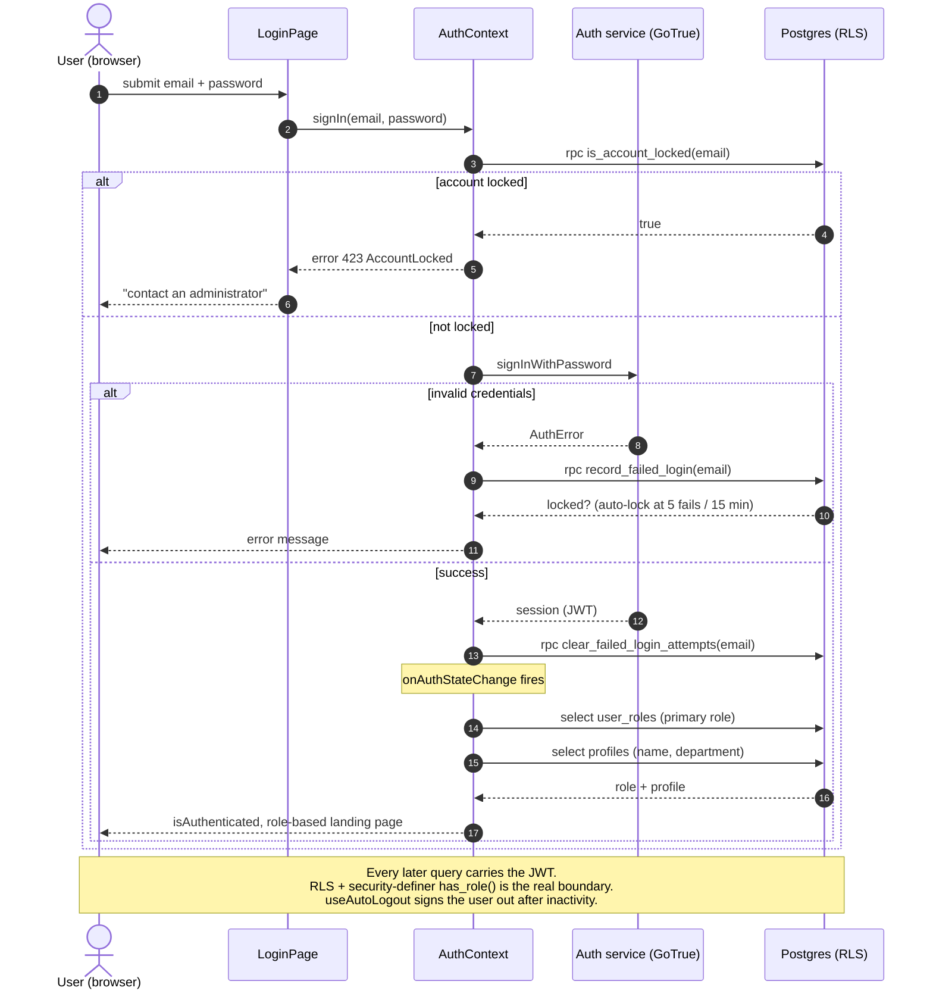
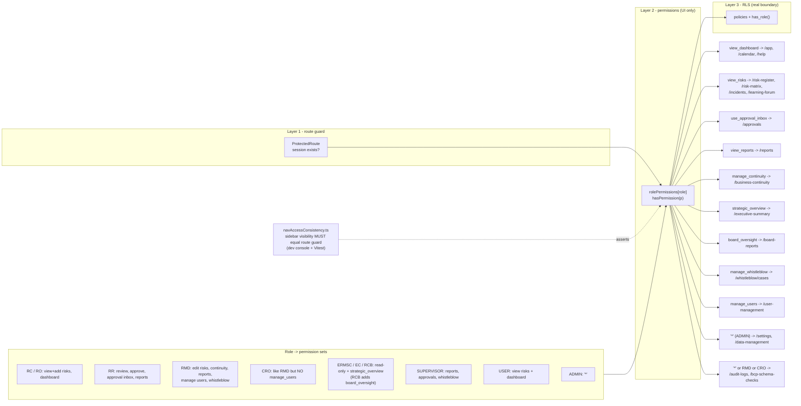
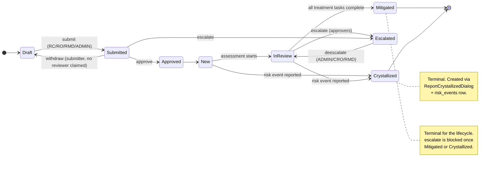
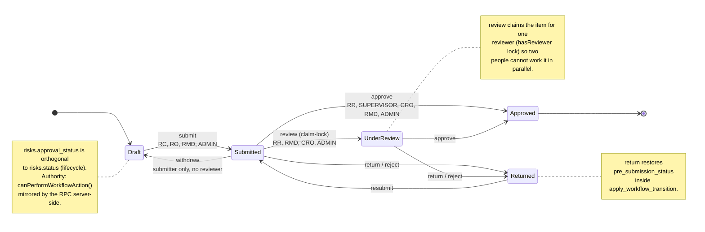

# RiskRadar — Codebase Architecture Guide

Audience: developers joining the team who will maintain, extend and review this codebase.
Goal: after reading this you should be able to (a) find anything, (b) add a feature without
breaking security or ISO 31000 semantics, and (c) defend every design decision in a code review.

Companion documents:

- `docs/adr/README.md` — [Architecture Decision Records](./adr/README.md): *why* each key choice
  was made (auth flow, permissions model, risk state machines). Read this alongside section 1.
- `docs/iso31000-naming.md` — domain glossary (enforced by `npm run lint:iso`)
- `docs/secure-db-guidelines.md` — database/Supabase rules (enforced by `npm run lint:db-safety`)
- `docs/react-review-checklist.md` — hooks and state rules
- `docs/peer-code-review.md` — review process, approvers, SLAs
- `docs/lifecycle-workflows.md` — risk/BCP/whistleblowing state machines
- [`docs/state-transition-spec.md`](./state-transition-spec.md) — per-state allowed transitions, guards and required fields for risks, incidents, whistleblowing and BCP
- `docs/deployment-guide.md`, `docs/onprem/*` — hosting, migrations, upgrade runbook
- `docs/testing-guide.md`, `docs/uat-test-plan.md` — unit / E2E / UAT
- [`docs/onboarding-runbook.md`](./onboarding-runbook.md) — local setup, env vars, build/preview, failure triage (blank page / CSP)
- [`docs/production-deployment-runbook.md`](./production-deployment-runbook.md) — production env config, build, migrations, cutover, rollback

- [`docs/migration-playbook.md`](./migration-playbook.md) — schema versioning, constraint enforcement, rollback

---

## 0. Diagram index — which diagram do I need?

Every diagram in the codebase, grouped by question it answers. Sources are Mermaid (`.mmd`)
under `docs/diagrams/`; most are also rendered inline further down this document.

### Flow & behaviour (start here when tracing "what happens when…")

| Diagram | Answers | Use it when |
| --- | --- | --- |
| [auth-flow](./diagrams/auth-flow.mmd) | Sign-in, failed-attempt lockout, profile/role hydration | Debugging login failures, lockouts, or "roles are empty on first render" |
| [role-navigation](./diagrams/role-navigation.mmd) | Role → permission → allowed route map | Adding a route/menu item, or auditing what a role can reach |
| [seq-role-navigation](./diagrams/seq-role-navigation.mmd) | Sequence: session hydration → nav filtering → RLS-filtered reads | A user sees a blank page/menu, or data differs between roles |
| [seq-risk-crud](./diagrams/seq-risk-crud.mmd) | Sequence: risk create/read/update/delete via supabase-js, RLS, triggers | Adding a field to risks, or diagnosing a failed insert/update |
| [seq-risk-approval](./diagrams/seq-risk-approval.mmd) | Sequence: submit → claim → approve/return via `apply_workflow_transition` | Changing approval rules or debugging a stuck approval |
| [seq-status-transitions](./diagrams/seq-status-transitions.mmd) | Sequence: status changes across risks, incidents, BCP, whistleblowing | Wiring a new status action in the UI to the backend |

### State machines (what states exist and which moves are legal)

Normative rules — guards and required fields per state — live in
[`state-transition-spec.md`](./state-transition-spec.md); these diagrams are the visual summary.

| Diagram | Entity / column | Use it when |
| --- | --- | --- |
| [risk-lifecycle](./diagrams/risk-lifecycle.mmd) | `risks.status` | Adding a risk status or validating a treatment transition |
| [risk-approval](./diagrams/risk-approval.mmd) | `risks.approval_status` | Working on the review/approval pipeline |
| [incident-lifecycle](./diagrams/incident-lifecycle.mmd) | `risk_events.status` | Building incident triage, assignment or closure UI |
| [whistleblow-lifecycle](./diagrams/whistleblow-lifecycle.mmd) | `whistleblow_cases.status` | Changing case triage, escalation or investigation flow |
| [bcp-lifecycle](./diagrams/bcp-lifecycle.mmd) | BCP `status` × `test_status` | Editing BCP plan approval or test-cycle logic |

### Data model (ERDs — tables, keys and relationships)

Consult before writing a migration; pair with
[`migration-playbook.md`](./migration-playbook.md) and
[`secure-db-guidelines.md`](./secure-db-guidelines.md) (RLS + GRANTs).

| Diagram | Domain | Use it when |
| --- | --- | --- |
| [erd-risk-register](./diagrams/erd-risk-register.mmd) | Risks, categories, treatments, tasks, history | Extending the register or writing register queries/reports |
| [erd-incidents](./diagrams/erd-incidents.mmd) | Crystallised risks / `risk_events`, ownership, timeline | Working on incident reporting or notifications |
| [erd-whistleblowing](./diagrams/erd-whistleblowing.mmd) | Cases, messages, attachments, anonymity boundary | Touching anonymous intake — check what must never join to `auth.users` |
| [erd-business-continuity](./diagrams/erd-business-continuity.mmd) | BCP plans, BIA fields, tests, version history | Changing BIA/test fields or version tracking |
| [erd-controls](./diagrams/erd-controls.mmd) | Risk controls, control documents, acknowledgements | Building control effectiveness or document repository features |
| [erd-learning-forum](./diagrams/erd-learning-forum.mmd) | Discussions, posts, votes, training modules | Working on the learning/forum module |
| [erd-role-permissions](./diagrams/erd-role-permissions.mmd) | `auth.users`, `profiles`, `user_roles`, sign-in history | Any permissions/RLS change — confirm roles stay in `user_roles` only |


---


## 1. What this system is

RiskRadar is an ISO 31000-aligned enterprise risk management portal. It digitises risk
identification, assessment, treatment and monitoring, plus adjacent modules: business
continuity (BCP/BIA), incidents (crystallised risks), whistleblowing, board reporting,
control documents, audit logs and role-based dashboards.

The important architectural consequence of the domain: **this is a compliance system, not a CRUD
app**. Two properties dominate every decision:

1. **Auditability** — who changed what, when, and from what value must always be reconstructible.
2. **Least privilege** — eleven roles with materially different visibility. Authorization must be
   enforced where it cannot be bypassed (the database), not only in the UI.

Everything below follows from those two properties.

---

## 2. Technology choices and why

| Layer | Choice | Rationale |
| --- | --- | --- |
| UI framework | React 18 + TypeScript 5 | Team familiarity; typed props catch domain mistakes (e.g. passing `likelihood` where `impact` is expected) at compile time. |
| Build | Vite 5 (`@vitejs/plugin-react-swc`) | Fast HMR; static `dist/` output is trivially served by nginx on-prem — no Node process in production. |
| Routing | React Router v6 | SPA routing with a single guard component; no framework-level server rendering required (the app is behind auth, SEO applies only to public pages). |
| Styling | Tailwind CSS v3 + shadcn/ui (Radix primitives) | Design tokens in `src/index.css` + `tailwind.config.ts` give one place to theme; Radix gives accessible primitives we do not have to re-audit. |
| Server state | React Query (`@tanstack/react-query`) for newer modules; bespoke hooks for older ones | See §6.3 — this is a known, deliberate inconsistency with a migration path. |
| Validation | Zod | One schema shape reused for client-side form validation and edge-function input validation. |
| Backend | Supabase (Postgres + PostgREST + GoTrue + Storage + Edge Functions) | Row Level Security lets us push authorization into the database, which is the only place it cannot be bypassed by a crafted HTTP call. Self-hostable, which the on-prem requirement demanded. |
| AI | Gemini 2.5 Flash via the AI gateway, called only from edge functions | Keeps the API key server-side; a local LLM can be substituted on-prem (see `docs/onprem`). |
| Scheduling | `pg_cron` + `pg_net` | No extra scheduler service to deploy or monitor on-prem. |
| PDF/Export | jsPDF + jspdf-autotable, `xlsx` | Client-side generation avoids shipping user data to a rendering service. |
| Tests | Vitest (unit) + Playwright (E2E, in `e2e/`) | Vitest shares the Vite config; Playwright covers RBAC end-to-end, which unit tests cannot. |

### Deliberate non-choices

- **No Next.js / SSR.** The app is authenticated; SSR would add a Node tier to every on-prem
  install for no user-visible benefit. Public marketing/docs pages get their SEO from
  `react-helmet-async` (`src/components/SeoHead.tsx`) plus prerendered metadata in `index.html`.
- **No Redux/Zustand.** Nearly all state is *server* state. Global client state is limited to auth
  and notifications, which are React contexts. Adding a store would mostly duplicate cache.
- **No ORM.** The Supabase typed client generates `src/integrations/supabase/types.ts` from the live
  schema, so the schema is the single source of truth. An ORM would create a second one.

---

## 3. Repository layout

```text
src/
  components/          shared + feature-scoped UI
    ui/                shadcn primitives — do not hand-edit beyond variants
    risk-register/     feature folders mirror routes
    bcp/  incidents/  dashboard/  board-reports/  settings/ ...
  contexts/            AuthContext, NotificationContext (global client state)
  hooks/               data-access + behaviour hooks (useRisks, useBCPData, useAutoLogout…)
  lib/                 pure domain logic + adapters (riskWorkflow, chartUtils, nrsPdf…)
  pages/               route-level components
  integrations/supabase/  AUTO-GENERATED client + types — never hand-edit
  docs/content.ts      in-app documentation viewer content
  test/                Vitest unit tests
supabase/
  functions/           Deno edge functions; _shared/cors.ts is common
  migrations/          cloud migration history (111 files, append-only)
  migrations-onprem/   bootstrap + delta bundles + verifier for self-hosted installs
scripts/               lint-iso31000.mjs, lint-db-safety.mjs (CI gates)
e2e/                   Playwright specs, fixtures, UAT reporter
docs/                  this file and all other written docs
```

### The `pages/X.tsx` vs `pages/XPage.tsx` pattern

Several modules have both (e.g. `RiskRegister.tsx` and `RiskRegisterPage.tsx`). The convention:

- `XPage.tsx` is the **route entry**: it composes `MainLayout`, `SeoHead`, permission checks and
  `AccessDenied` fallbacks.
- `X.tsx` is the **content component**: pure feature UI, no layout or guard concerns.

Rationale: the guard/layout wrapper is identical across ~20 routes; separating it keeps the feature
component testable in isolation and keeps guard logic in one reviewable shape.
*Review note:* if you add a route, follow this pattern — do not put `<MainLayout>` inside the
content component.

---

## 4. Authentication and authorization

This is the part reviewers scrutinise hardest. There are **three** enforcement layers and they must
agree.

Sign-in flow ([source](./diagrams/auth-flow.mmd)):



Role → permission → route map ([source](./diagrams/role-navigation.mmd)):




### 4.1 Layer 1 — route guard (`src/components/ProtectedRoute.tsx`)

Wraps every entry in the `protectedRoutes` array in `src/App.tsx`. It only answers *"is there a
session?"* — it renders a spinner while `isLoading`, and redirects to `/` otherwise.

Rationale for the spinner: without it, the first render has `isAuthenticated === false` and every
protected route would flash a redirect to the landing page on refresh.

Public routes (`/`, `/help`, `/docs`, `/whistleblow*`, `/reset-password`, `/app`) live **outside**
that array. `/whistleblow` in particular must stay public and unauthenticated — anonymity is a
requirement, not an oversight.

### 4.2 Layer 2 — permissions (`src/contexts/AuthContext.tsx`)

`rolePermissions` maps each of the 11 roles to permission strings; `hasPermission(p)` is the only
sanctioned client-side check. `ADMIN` holds `'*'`.

This layer decides **what the UI offers** — sidebar entries, buttons, tabs. It is *not* a security
boundary: anyone can edit the bundle in their browser. Its job is usability (don't show a user a
button that will 403).

`src/lib/navAccessConsistency.ts` runs in dev (`src/main.tsx`) and in a Vitest test
(`src/test/navAccessConsistency.test.ts`) to assert that **sidebar visibility matches route
permissions for every role**. This exists because a real bug shipped once: CRO saw a
`/user-management` link it could not use. Treat a failure here as a blocker.

### 4.3 Layer 3 — Row Level Security (the actual boundary)

Every `public` table has RLS enabled with explicit policies, and every table has explicit `GRANT`s.
PostgREST does **not** grant default privileges on `public`, so a table without `GRANT` returns a
permission error even with correct policies. Migration order is non-negotiable:

```sql
CREATE TABLE public.foo (...);
GRANT SELECT, INSERT, UPDATE, DELETE ON public.foo TO authenticated;
GRANT ALL ON public.foo TO service_role;
ALTER TABLE public.foo ENABLE ROW LEVEL SECURITY;
CREATE POLICY ... ON public.foo ...;
```

**Roles live in a separate `user_roles` table, never on `profiles`.** Storing a role on the row a
user can update is a privilege-escalation vector. Policies call the security-definer helper:

```sql
public.has_role(auth.uid(), 'ADMIN')
```

`SECURITY DEFINER` + `SET search_path = public` is required: without it, a policy on `profiles`
that selects from `profiles` recurses infinitely, and an unpinned `search_path` is a known
injection vector.

**Writes that need cross-row authority go through `SECURITY DEFINER` RPCs,** not permissive
`INSERT` policies. Example: workflow transitions and appetite re-evaluation. Rationale: a policy
that must be permissive enough for a legitimate insert is usually permissive enough for an
illegitimate one; an RPC can validate the whole transition atomically.

*Common review question — "why is the same rule expressed three times?"* Because they answer
different questions: layer 1 = is there a session, layer 2 = should we render this, layer 3 = is
this operation allowed. Removing layer 3 is a vulnerability; removing layer 2 is a UX regression.

### 4.4 Session behaviour

`useAutoLogout.ts` implements the 5-minute inactivity logout required by the security policy.
`SessionBanner.tsx` warns before expiry rather than dropping unsaved work silently.

In `AuthContext`, the profile fetch inside `onAuthStateChange` is wrapped in `setTimeout(..., 0)`.
This is intentional and must not be "cleaned up": calling another Supabase client method
synchronously inside the auth callback deadlocks the client's internal lock. Leave the comment in
place — this has been re-introduced by well-meaning refactors before.

---

## 5. Domain model and ISO 31000 semantics

### 5.1 Vocabulary is enforced

`npm run lint:iso` fails the build on deprecated synonyms. Use:

- `likelihood` and `impact` — never `probability`, never `severity` for a risk score component
- `inherent_*` (before controls) and `residual_*` (after controls)
- `treatment` for the strategy (Avoid / Mitigate / Transfer / Accept) — "mitigation" is one
  treatment option, not a synonym for the concept
- `control_effectiveness` for control scoring

Rationale: auditors read our screens and exports. Inconsistent terminology has repeatedly caused
rework in ISO 31000 assessments, so it is a CI gate, not a style preference.

### 5.2 Two orthogonal state machines on `risks`

This trips up almost every new developer. `src/lib/riskWorkflow.ts` documents both:

- **`risks.status`** — the *lifecycle*: `Draft → Submitted → Approved → New → In Review →
  Mitigated`, plus terminal `Crystallized` and `Escalated`.
- **`risks.approval_status`** — the *approval pipeline*: `Draft → Submitted → Under Review →
  Approved → Returned`.

They are separate because a risk can be approved (governance) yet still open (lifecycle), and an
in-review risk can be returned without resetting its lifecycle. Collapsing them into one column
was tried and produced states that could not be expressed.

`canPerformWorkflowAction(action, approvalStatus, role, context)` is the single authority for
whether a workflow button renders. It is a pure function, unit-tested in
`src/test/riskWorkflow.test.ts`, and mirrors the server-side RPC rules. If you change one side,
change both in the same PR — the test suite will not catch a server/client drift for you.

Notable rules encoded there: reviewer *claim-lock* (`hasReviewer`) prevents two reviewers working
the same item; `withdraw` is only available to the submitter while still `Submitted`;
`deescalate` is restricted to ADMIN/CRO/RMD.

Lifecycle — `risks.status` ([source](./diagrams/risk-lifecycle.mmd)):



Approval pipeline — `risks.approval_status` ([source](./diagrams/risk-approval.mmd)):




### 5.3 Reference data: tables, not enums

`risk_categories` and the departments lookup table are the **single source of truth**. A database
trigger syncs new category names into the `risk_category` Postgres enum so legacy enum-typed
columns keep working.

Rationale: enums require a migration to extend, which admins cannot do at runtime; a table with a
sync trigger gives admins self-service without breaking existing typed columns. Consume them via
`useRiskCategories()` / `useDepartments()` — never hardcode a category list in a component.

### 5.4 Scoring, appetite and thresholds

- Risk score = likelihood × impact against the configurable matrix
  (`useMatrixDimensions`, `MatrixDimensionsManager`).
- **High severity threshold is score ≥ 15.** It appears in dashboards, alerts and reports — change
  it in the shared helper, never inline in a component.
- Risk appetite rules are applied automatically by the `reevaluate_risk_appetite()` RPC and its
  trigger, so appetite breaches cannot drift out of date when a score changes.
- Budget monitoring is in NGN by default; utilisation colours are <75 % green, 75–90 % yellow,
  >90 % red (`useBudgetForecast`, `BudgetDashboardWidget`).

### 5.5 Audit trail

`risk_history` stores JSONB before/after snapshots per change. `/audit-logs` exposes a "Risk
Changes" tab to RMD, CRO and ADMIN with search, date-range filters, sortable columns, pagination
and diffs; the user's sorting/page-size/filter choices persist to `localStorage`.

Rationale for JSONB snapshots over a column-per-field audit table: the risk schema evolves, and a
narrow audit table silently stops recording new fields. JSONB records whatever existed at the time.

BCP has its own equivalent (`bcp_version_history` + `BCPVersionHistoryPanel`), and
`bcp_schema_check_logs` (viewer at `/bcp-schema-checks`) records whether the startup schema
verification found missing columns — this exists because a partially-applied on-prem migration
previously produced silent save failures.

---

## 6. Frontend patterns

### 6.1 Layout and composition

`MainLayout` = `Header` + `Sidebar` + content. `Sidebar` derives its items from the same permission
map as the routes (see §4.2). `ErrorBoundary` wraps risky routes (currently `/audit-logs`) so a
render error shows a recoverable fallback rather than a white screen.

Design-system rule: **no hardcoded colour utilities** (`text-white`, `bg-[#123456]`). Everything
goes through semantic tokens in `src/index.css` and shadcn variants, or dark mode and future
re-theming break. This is checked in review.

### 6.2 Component size

Split components over ~300 LOC or with deep prop drilling. Feature folders exist precisely so a
page can be decomposed without polluting a shared namespace. Dialogs are their own components
(`AddBCPDialog`, `RiskWizardDialog`, …) because they own substantial form state.

### 6.3 Data fetching — the known inconsistency

Two patterns exist:

1. **Bespoke hooks** (`useRisks`, `useBCPData`, …): `useState` + `useEffect` + a manual
   `fetch/refetch`. These are the older modules.
2. **React Query** — used by newer modules.

This is technical debt with a rule attached: **match the surrounding module**. Do not introduce a
third pattern, and do not half-migrate a module in an unrelated PR. New standalone modules should
use React Query.

Why the bespoke hooks still exist: they also shape DB rows into view models (see `RiskData` in
`useRisks.ts` — camelCase view fields plus a few retained snake_case fields the workflow components
need). Migrating them is a behavioural change that needs its own test pass, not a drive-by.

### 6.4 Hooks discipline

- Rules of Hooks is an ESLint **error**. A real production incident ("Rendered more hooks than
  during the previous render" in `AuditLogViewer`) came from an early return placed above a hook.
  Never put a conditional `return` before the last hook call in a component.
- `exhaustive-deps` is a **warning**, not an error, because this codebase has legitimate intentional
  omissions — but any omission needs a comment explaining why.
- Always clean up subscriptions, timers and realtime channels in the effect's return
  (`useRealtimeRisks`, `NotificationContext`).
- `useMemo`/`useCallback` only where there is a measured cost. Blanket memoisation adds allocation
  and dependency-array bugs.

### 6.5 URL and persisted state

List views (incidents, BCP) persist filters, search, page and sort in the **URL** so a filtered view
is shareable and survives refresh. Audit-log preferences persist to `localStorage` because they are
personal preferences, not shareable views. Pick the mechanism by that test.

`localStorage` is never used for authorization decisions.

---

## 7. Backend: edge functions

Located in `supabase/functions/`. Rules, all enforced in review:

1. **CORS on every response, including errors.** Use `buildCors(req)` from `_shared/cors.ts`, which
   applies an allowlist (`ALLOWED_ORIGINS` env plus Lovable preview/production/custom domains and
   localhost). A disallowed origin gets *no* `Access-Control-Allow-Origin` header, so the browser
   blocks it — chosen over `*` because several functions run with elevated privilege.
2. **Validate all input with Zod**, return `400` with `error.flatten()` on failure.
3. **Verify the JWT** for authenticated functions; the anonymous whistleblowing functions are the
   deliberate exception and compensate with rate limiting, Turnstile captcha, HTML sanitisation and
   strict payload validation.
4. **Never log secrets** (`SUPABASE_SERVICE_ROLE_KEY`, `LOVABLE_API_KEY`, SMTP creds, JWTs).
5. Functions that need to bypass RLS use the service-role client *inside the function only* — never
   in browser code.

Function inventory (why each is server-side rather than client-side):

| Function | Reason it must be server-side |
| --- | --- |
| `risk-ai-analysis`, `risk-scoring-engine`, `mitigation-recommender`, `ai-report-generator`, `lob-data-import` | Hold the AI gateway key; also batch across rows the caller may not be allowed to read individually. |
| `whistleblow-submit`, `whistleblow-follow-up`, `whistleblow-config` | Anonymity: the reporter must never hold a session, so a service-role function mediates all access. |
| `admin-invite-user` | Requires admin auth API. |
| `check-deadlines`, `scheduled-reports`, `backup-scheduler` | Invoked by `pg_cron`/`pg_net` on a schedule. |
| `backup-operations`, `export-onprem-snapshot` | Privileged data export for on-prem cloning. |
| `send-notification-email` | Holds SMTP credentials. |
| `risk-categories-rls-tests` | Executable RLS regression tests against the live policies. |

Scheduled jobs: deadline warnings run daily at 08:00 (7-day warning + overdue alerts); report
generation/archiving runs hourly.

---

## 8. Whistleblowing — a subsystem with different rules

Because anonymity is a hard requirement, this module intentionally violates patterns used elsewhere:

- Routes `/whistleblow`, `/whistleblow/submit`, `/whistleblow/status`, `/whistleblow/follow-up` are
  public and must stay outside `protectedRoutes`.
- The reporter is identified only by a follow-up token. There is **no reporter row in `profiles`**,
  so no RLS policy can be written for them — all reporter-side reads/writes go through service-role
  edge functions. Security scans that flag "missing reporter INSERT policy" on
  `whistleblow_attachments` / `whistleblow_messages` are expected: the design is fail-closed by
  intent, and the rationale is recorded in the security memory.
- Evidence uploads go to the `whistleblow-evidence` bucket: max 5 files, 10 MB each, progress
  reported per file.
- Investigation SLAs: auto-flag when unassigned > 14 days or stagnant > 60 days.

If you touch this module, re-read `docs/whistleblowing-user-guide.md` first.

---

## 9. Storage buckets

`avatars`, `control-documents`, `risk-attachments`, `whistleblow-evidence`, `bcp-documents`,
`onprem-exports`. All private; downloads use signed URLs with short TTLs. Migrations create
**policies**, not buckets — on a fresh on-prem install the buckets must be created before functions
run, or uploads fail with an opaque error.

---

## 10. Database migrations

- `supabase/migrations/` is **append-only**. Never edit an applied migration; write a new one. An
  edited migration is already applied in cloud and will diverge from on-prem forever.
- Every new `public` table: `GRANT` + `ENABLE ROW LEVEL SECURITY` + policies, in the same file.
- Time-dependent logic goes in `BEFORE INSERT/UPDATE` triggers, never `CHECK` constraints —
  `CHECK (expire_at > now())` is not immutable and breaks `pg_restore`.
- Server-side validation triggers (e.g. `validate_bcp_bia_test_fields()`) enforce types/formats the
  UI also validates. `src/lib/bcpServerErrors.ts` maps trigger rejections back to inline field
  errors, so a server rejection is not just an opaque toast.
- On-prem: `supabase/migrations-onprem/` holds bootstrap (`000`), the JWT/RLS compatibility fix
  (`001`), demo seed (`002`), dated delta bundles, snapshot loader (`998`) and the verifier (`999`).
  After any delta, `999_verify_install.sql` sections 3 (missing GRANTs), 4 (RLS disabled) and 5 (RLS
  with no policies) must each return **zero rows**. Delta bundles guard every reference to a
  possibly-absent column with a `DO` block, because partially-upgraded installs are the norm.

---

## 11. Testing

| Layer | Tool | Location | What it must cover |
| --- | --- | --- | --- |
| Pure domain logic | Vitest | `src/test/` | Workflow transitions, assessment progress, server-error mapping, nav/access consistency |
| RLS | Deno test | `supabase/functions/risk-categories-rls-tests/` | Policies behave per role against the live DB |
| End-to-end / UAT | Playwright | `e2e/` | Auth, role landing pages, sidebar access, negative RBAC; cross-browser + responsive viewports; UAT report via `e2e/reporters/uat-report.ts` |

Negative RBAC tests are as important as positive ones: asserting a CRO **cannot** reach
`/user-management` is what prevents permission regressions.

---

## 12. Review checklist quick reference

Run before requesting review:

```bash
npm run lint:iso        # ISO 31000 glossary
npm run lint:db-safety  # SQL / Supabase safety scan
npm run lint            # ESLint (hooks + TS)
npm run test            # Vitest
```

Blockers a reviewer should reject on:

- New `public` table without `GRANT` + RLS + policy in the same migration
- Any authorization decision read from `localStorage`/`sessionStorage`/a hidden field
- String-interpolated SQL, or `rpc('execute_sql', …)`
- Edge function missing CORS on an error path, or missing Zod validation
- Conditional hook call / early return above a hook
- Hardcoded colour utilities instead of semantic tokens
- Deprecated risk vocabulary
- Editing `src/integrations/supabase/client.ts`, `types.ts`, `.env`, or an applied migration
- Secrets or backend dashboard links committed

Approver matrix and SLAs: `docs/peer-code-review.md`.

---

## 13. Adding a feature — worked example

Adding "Risk Insurance Register":

1. **Migration** — `CREATE TABLE public.risk_insurance (...)`, then `GRANT`s, then
   `ENABLE ROW LEVEL SECURITY`, then policies using `has_role()`. Add an audit trigger writing
   JSONB snapshots if the data is auditable.
2. **Types** — regenerate `src/integrations/supabase/types.ts` (auto-generated; do not hand-edit).
3. **Hook** — `src/hooks/useRiskInsurance.ts` using React Query.
4. **Components** — `src/components/risk-insurance/`, each under ~300 LOC, tokens only.
5. **Page** — `RiskInsurancePage.tsx` (layout + guard) wrapping `RiskInsurance.tsx` (content).
6. **Route** — add to `protectedRoutes` in `src/App.tsx`.
7. **Permission** — add the permission string to `rolePermissions`, add the sidebar entry, and make
   sure `navAccessConsistency` passes.
8. **Tests** — Vitest for any pure logic; a Playwright spec asserting both an allowed and a denied
   role.
9. **Docs** — add a section to `src/docs/content.ts` if it is user-facing.
10. **Lint gates** — run all four commands above.

---

## 14. Known debt (say this out loud in review rather than rediscovering it)

- Mixed data-fetching patterns (§6.3); React Query is the target.
- `mockUsers` remains in `AuthContext.tsx` from the prototype phase; it is unused by the live auth
  path and should be deleted once no demo flow references it.
- `exhaustive-deps` warnings are non-zero; each should acquire a comment or a fix over time.
- Some legacy columns (e.g. whistleblowing `case_number`) are retained nullable for on-prem
  compatibility rather than dropped.
- Client-side PDF generation is memory-heavy for very large board reports; a server-side path is
  the fallback if that becomes a complaint.
